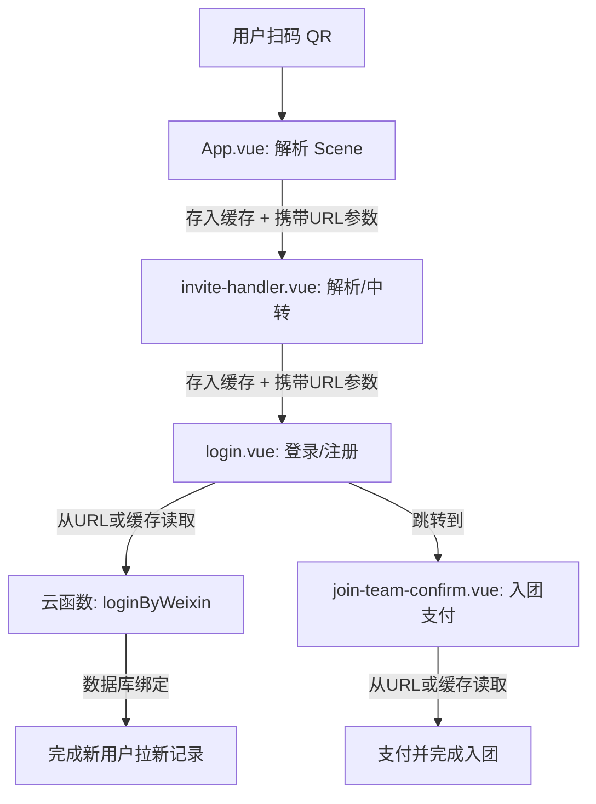

# 五、双重保险邀请机制说明 🛡️

为了彻底解决小程序扫码邀请人信息在跳转、登录及注册过程中丢失的问题，我们实现了 **URL参数 + 全局缓存** 的“双重保险”机制。

## 1. 核心设计思路

系统不再仅仅依赖单一的本地缓存，而是通过 URL 参数在页面间“接力”传递邀请人 ID，同时在每个节点实时同步到全局缓存作为备份。

### 双重存储策略
- **URL 参数接力 (第一保险)**: `App.vue` -> `invite-handler` -> `login` -> `join-team-confirm`。每一个步骤都在 URL 中明确带上 `inviter_id`。
- **全局缓存备份 (第二保险)**: 每个页面在接收到 URL 参数时，立即同步更新 `pending_team_invite` 缓存。如果后续页面 URL 因意外丢失参数，系统会自动从缓存中恢复。

---

## 2. 逻辑流转图

---

## 3. 关键改进细节

### A. 全程 URL 携带 `inviter_id`
即使在 `App.vue` 解析出 `scene` 后跳转中转页，我们也会显式拼接参数：
`/pages/extra/invite-handler?scene=xxx&inviter_id=uid123`

### B. 二级优先级读取
在 `login` 和 `join-team-confirm` 页面中，读取逻辑统一为：
1. **优先：** `options.inviter_id` (来自 URL，最新最准)
2. **兜底：** `uni.getStorageSync('pending_team_invite')` (来自缓存，防止丢失)

### C. 延迟清除策略
- ❌ **旧逻辑：** 页面一加载就清除缓存，导致如果注册失败后再重新操作就没了。
- ✅ **新逻辑：** 只有当**用户成功登录/注册** 或 **成功支付入团** 后，才调用 `removeStorageSync` 清除该次邀请缓存。

---

## 4. 如何验证？

您可以查看页面底部的**统一调试栏**：
- **扫码后：** 观察 `团队:` 字段是否立即显示了邀请人的 ID。
- **跳转到登录页：** 如果 URL 包含 `inviter_id` 且调试栏有值，说明第一保险生效。
- **手动清掉 URL (测试)：** 如果手动把 URL 参数删了进登录页，调试栏依然显示邀请人，说明第二保险（缓存兜底）生效。

---

## 5. 相关文件清单
1. `App.vue`: 扫码入口解析与参数分发
2. `pages/extra/invite-handler.vue`: 中转确认与缓存同步
3. `pages/auth/login/index.vue`: 注册时的参数注入
4. `pages/extra/join-team-confirm.vue`: 入团支付时的参数保障
5. `user-center (云函数)`: 注册接口的参数记录
